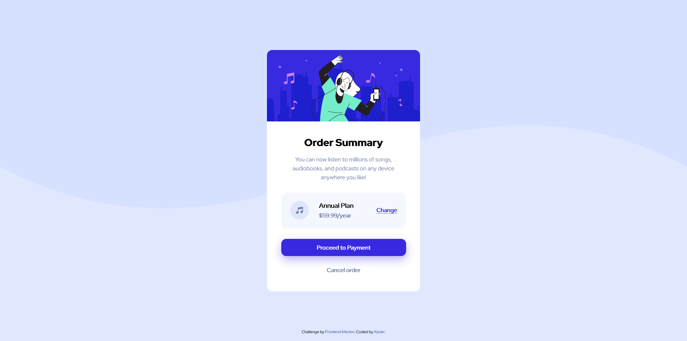

# Frontend Mentor - Order summary card solution

This is a solution to the [Order summary card challenge on Frontend Mentor](https://www.frontendmentor.io/challenges/order-summary-component-QlPmajDUj). Frontend Mentor challenges help you improve your coding skills by building realistic projects. 

## Table of contents

- [Overview](#overview)
  - [The challenge](#the-challenge)
  - [Screenshot](#screenshot)
  - [Links](#links)
- [My process](#my-process)
  - [Built with](#built-with)
  - [What I learned](#what-i-learned)
  - [Continued development](#continued-development)
- [Author](#author)

## Overview

### The challenge

Users should be able to:

- See hover states for interactive elements

### Screenshot



### Links

- Live Site URL: [DEMO LIVE](https://xavier192.github.io/order-summary-challange/)

## My process

### Built with

- Semantic HTML5 markup
- CSS3 custom properties
- Flexbox
- RWD (Responsive Web Design).

### What I learned

- Background using CSS.

```css
body {
  background-image:url(../img/background.jpg);
}
```
- Negative margins using flexbox helps positioning.

### Continued development

- CSS grid and animations.

## Author

- Frontend Mentor - [@Xavier192](https://www.frontendmentor.io/profile/Xavier192)

